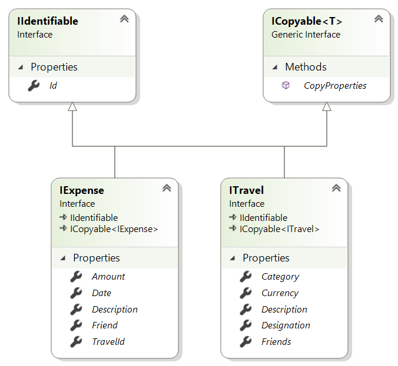
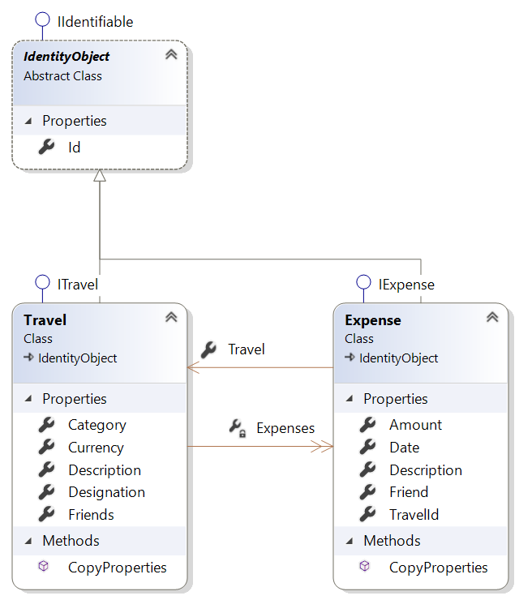

# TravelCount

Das ist die erste Zeile.  
Das ist die zweite Zeile.  
## Schnittstellen für die Entitäten



## Klassendiagramm der Entitäten



## Nächstes Kapitel
Das ist eine lange Zeile mit viel Text und dieser soll automatisch umgebrochen werden.  
Jetzt kommt die Aufzählung:  
+ Erster Punkt
+ Zwiter Punkt
+ usw.  

Jetzt wird wieder in einer neuen Zeile geschrieben.  
Dieses Wort **CSharp** wird in fett geschrieben.  
```csharp
class Person
{
  public string Name { get; set;}
}
```  
Die Eigenschaft *'Name'* setzt oder liefert den Namen der Person. 