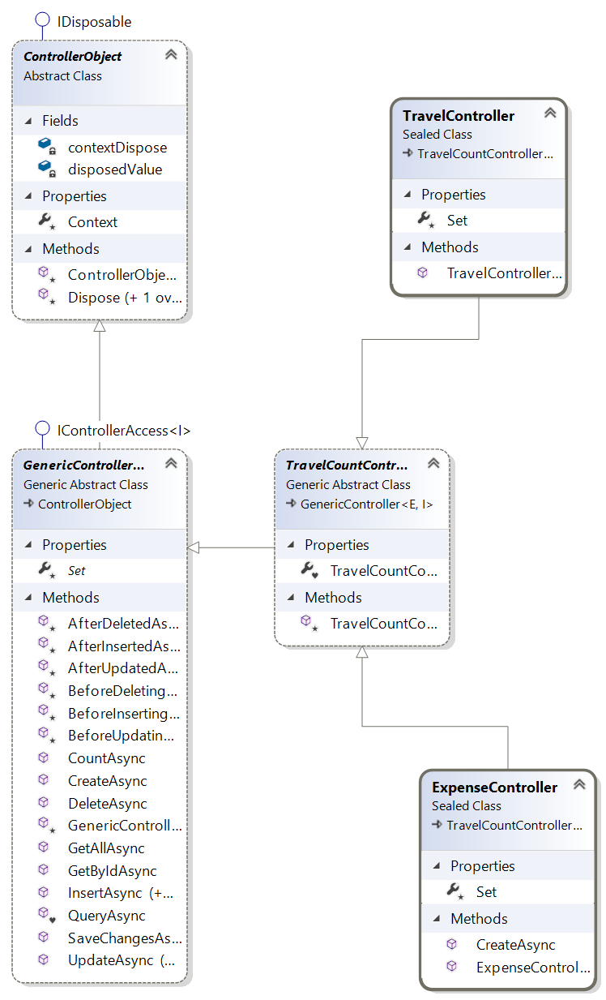

- [TravelCount (Teil A)](#TravelCount-teil-a)
  - [Projekt](#projekt)
    - [Projektstruktur](#projektstruktur)
    - [Datenstruktur](#datenstruktur)
    - [Teilprojekt: TravelCount.Contracts](#teilprojekt-TravelCountcontracts)
      - [Implementierung der Schnittstellen](#implementierung-der-schnittstellen)
    - [Teilprojekt: TravelCount.Logic](#teilprojekt-TravelCountlogic)
      - [Entitäten](#entit%c3%a4ten)
      - [Implementierung der Kontroller](#implementierung-der-kontroller)
      - [DataContext](#datacontext)
      - [Fabrik-Klasse](#fabrik-klasse)
    - [Erweiterung Teil B](#erweiterung-teil-b)

# TravelCount (Teil A)

Das Projekt 'TravelCount' ist ein kleines datenzentriertes Anwendungsbeispiel mit welchem die Erstellung eines Software-Systems dargestellt werden soll. Aufgrund der Komplexität, die ein Software-System im Allgemeinem darstellt, ist die Erstellung des Beispiels in mehreren Abschnitten unterteilt. Die Aufteilung ist wie folgt definiert:  

+ **Teil A** bildet die Basis des Systems und wird in den weiteren Ausbaustufen erweitert 
+ **Teil B** ist die Erweiterung von Teil A mit asynchronen Methoden
+ **Teil C** erweitert das System um eine Web-Api (REST-) Schnittstelle
+ **Teil D** ist die Entwicklung eines Adapters, welcher den direkten Zugriff auf die Geschäftslogik oder über einen indirekten Zugriff mit dem Web-Api (REST) abstrahiert.
+ Teil E (in Bearbeitung) fügt eine Mvc-Client zur Anwendung hinzu
+ Teil F (in Bearbeitung) verwendet einen Blazor-Client als Präsentationsschicht
+ Teil G (in Bearbeitung) zeigt wie die gesamte Anwendungsstruktur durch den Einsatz eines Code-Generator unterstützt werden kann

## Projekt

Zur Umsetzung des Projektes wird DotNetCore (3.0) als Framework, die Programmiersprache CSharp (C#) und die Entwicklungsumgebung Visual Studio 2019 Community verwendet. Alle Komponenten können kostenlos aus dem Internet heruntergeladen werden.

### Projektstruktur

Als Domainname wird 'TravelCount' verwendet und steht für die Gesamtlösung 'TravelCount'. Das Gesamtprojekt wird in Teilprojekte unterteilt wobei jedes bestimmten Lösungen für einen Teilbereich der Gesamtlösung beinhaltet. Als Namenskonvention für solche Projekt gilt die folgende Regel:  

+ [Domainname].[Bereich] => TravelCount.[Bereich]  

Zum Beispiel wird für den Bereich der Schnittstellen der Name 'TravelCount.Contracts' generiert. In diesem Projekt befinden sich alle für die Domäne relevanten Schnittstellen. 
Die Aufteilung, für den Teil A, erfolgt nach der folgenden Struktur:  

|Projekt|Beschreibung|Typ|Abhängigkeit
|---|---|---|---|
|**CommonBase**|In dieser Projekt werden alle Hilfsfunktionen und allgemeine Erweiterungen zusammengefasst. Diese sind unabhängig vom Problembereich und können auch in andere Domän-Projekte verwendet werden.|Library|keine
|**TravelCount.Contracts**|In dieser Projekt werden alle für das System notwendigen Schnittstellen und Enumerationen umgesetzt.|Library|keine
|**TravelCount.Logic**|Dieser Projekt beinhaltet den vollständigen Datenzugriff, die gesamte Geschäftslogik und stellt somit den zentralen Baustein des Systems dar. |Library|CommonBase, TravelCount.Contracts
|**TravelCount.ConApp**|Dieses Projekt ist eine einfache Test-Anwendung zum Kopieren und Ausgeben der Daten. |Console|TravelCount.Contracts, TravelCount.Logic

### Datenstruktur

Die Datenstruktur vom 'TravelCount' ist überschaulich und besteht im wesentlichen aus 4 Komponenten welche in der folgenden Tabelle zusammengefasst sind:

|Komponente|Beschreibung|Grösse|Mussfeld|Eindeutig|
|---|---|---|---|---|
|**Artist**|Der Artist interpretiert und komponiert unterschiedlichste Musik-Titeln. Diese werden in einer oder mehreren Sammlung(en) (Album) zusammengefasst.|
|*Name*|Name und des Artisten|1024|Ja|Ja|
|**Album**|Das Album beinhaltet eine Sammlung von Musik-Titeln (Track) und ist einem Artisten zugeortnet.|||
|*Title*|Titel des Albums|1024|Ja|Ja|
|*ArtistId*|Fremdschüssel zum Artisten|int|Ja|Nein|
|**Genre**|Das Genre definiert eine Musikrichtung und dient zur Klassifikation. Diese Information muss einem Musiktitel (Track) zugeordnet sein.|||
|*Name*|Name vom Genre|256|Ja|Ja|
|**Track**|Der Track definiert einen Musik-Titel und ist einem Album zugeordnet. Über das Album kann der Artist ermittelt werden.|||
|*Title*|Titel des Musikstückes|1024|Ja|Nein|
|*Composer*|Komponist des Musikstückes|512|Nein|Nein|
|*Bytes*|Größe, in Bytes, des Titles|long|Ja|Nein|
|*Milliseconds*|Zeit des Titles|long|Ja|Nein|
|*UnitPrice*|Kosten des Titles|double|Ja|Nein|
|*GenreId*|Fremdschüssel zum Genre|int|Ja|Nein|
|*AlbumId*|Fremdschüssel zum Album|int|Ja|Nein|
|**Hinweis**|Alle Komponenten haben eine eindeutige Identität (Id)||||
|*|*Natürlich können noch weitere Attribute hinzugefügt werden.*||||

Aus dieser Definition kann ein entsprechendes Objektmodell abgeleitet werden, welches nachfolgend skizziert ist:


Wie aus der Abbildung leicht erkennbar ist, sind für alle Entitäten Schnittstellen definiert. Diese Schnittstellen sind im Projekt 
'TravelCount.Contracts' im Ordner 'Persistence' definiert und dienen zur Interaktion mit den Entitätsobjekten außerhalb der Bibliothek. Das Model zeigt auch noch eine Basisklasse mit dem Namen 'IdentityObject'. Diese Klasse ist die Basisklasse für alle Entitäten im System und definiert die Identität der Objekte und beinhaltet die Eigenschaft, mit welcher die Identität eines Entitätstyp eindeutig bestimmt wird. Im Moment besteht diese Eigenschaft aus einer Id mit dem Datentyp Integer und wird vom System automatisch vergeben.  

**Achtung:** Die Entitäten sind von der Sichtbarkeit 'internal' und können nicht außerhalb der Bibliothek verwendet werden.

### Teilprojekt: TravelCount.Contracts

Wie bereits schon erwähnt, befinden sich alle öffentlichen Schnittstelle in diesem Projekt. Die Definitionen der Schnittstellen für die Entities 
befinden sich im Ordner 'Persistence'. In diesem Ordner befinden sich alle Schnittstellen für die Entitäten, welche im Projekt 'TravelCount.Logic' definiert sind und eine direkten Bezug zu einer Persistenzquelle (z.B. Datenbank Tabelle) haben. Der Klassendesigner zeigt folgendes Diagramm für die Schnittstellen der persistierenden Entitäten: 

  

Zu beachten ist, dass keine Schnittstelle die Navigationseigenschaften der Entitäten modelliert. Das ist sehr wichtig, weil dadurch unbeabsichtigte Fehler entstehen können. Die Erklärung erfolgt im Teil C Web-Api (REST).  

#### Implementierung der Schnittstellen  

```csharp ({"Type": "FileRef", "File": "Contracts/IIdentifiable.cs", "StartTag": "//MdStart", "EndTag": "//MdEnd" })
namespace TravelCount.Contracts
{
    /// <summary>
    /// Defines the basic properties of identifiable components.
    /// </summary>
    public partial interface IIdentifiable
    {
        /// <summary>
        /// Gets the identity of the component.
        /// </summary>
        int Id { get; }
    }
}
```  

Die Schnittstelle 'IIdentifyable' definiert eine schreibgeschützte Eigenschaft 'Id'. Diese Eigenschaft kann nur innerhalb des Projektes 'TravelCount.Logic' verändert werden. Diese Schnittstelle bildet die Basis für alle anderen Schnittstellen der Kategorie 'Entity'.  

```csharp ({"Type": "FileRef", "File": "Contracts/ICopyable.cs", "StartTag": "//MdStart", "EndTag": "//MdEnd" })
namespace TravelCount.Contracts
{
	/// <summary>
	/// Defines a generalized copying method for all properties defined by the Type T.
	/// </summary>
	/// <typeparam name="T">The type of object to copy.</typeparam>
	public partial interface ICopyable<T>
	{
		void CopyProperties(T other);
	}
}
```  

Die Schnittstelle 'ICopyable\<T\>' dient zum Übertragen der Daten von einer Entität zu einer anderen Entität.

Nachfolgend, die Definition der Schnittstellen für die Entität 'Album':  

```csharp ({"Type": "FileRef", "File": "Contracts/Persistence/IAlbum.cs", "StartTag": "//MdStart", "EndTag": "//MdEnd" })
namespace TravelCount.Contracts.Persistence
{
    /// <summary>
    /// Defines all public properties of an album.
    /// </summary>
    public interface IAlbum : IIdentifiable, ICopyable<IAlbum>
    {
        /// <summary>
        /// Gets or sets the reference id from an artist.
        /// </summary>
        int ArtistId { get; set; }
        /// <summary>
        /// Gets or sets the title of this instance.
        /// </summary>
        string Title { get; set; }
    }
}
```

Die Definition der Schnittstellen für die Entität 'Genre':

```csharp ({"Type": "FileRef", "File": "Contracts/Persistence/IGenre.cs", "StartTag": "//MdStart", "EndTag": "//MdEnd" })
namespace TravelCount.Contracts.Persistence
{
    /// <summary>
    /// Defines all properties of a genre.
    /// </summary>
    public interface IGenre : IIdentifiable, ICopyable<IGenre>
    {
        /// <summary>
        /// Gets or sets the name of this instance.
        /// </summary>
        string Name { get; set; }
    }
}
```

Die Definition der Schnittstellen für die Entität 'Artist':

```csharp ({"Type": "FileRef", "File": "Contracts/Persistence/IArtist.cs", "StartTag": "//MdStart", "EndTag": "//MdEnd" })
namespace TravelCount.Contracts.Persistence
{
    /// <summary>
    /// Defines all properties of an artist.
    /// </summary>
    public interface IArtist : IIdentifiable, ICopyable<IArtist>
    {
        /// <summary>
        /// Gets or sets the name of this instance.
        /// </summary>
        string Name { get; set; }
    }
}
```

Die Definition der Schnittstellen für die Entität 'Track':

```csharp ({"Type": "FileRef", "File": "Contracts/Persistence/ITrack.cs", "StartTag": "//MdStart", "EndTag": "//MdEnd" })
namespace TravelCount.Contracts.Persistence
{
    /// <summary>
    /// Defines all properties of a track.
    /// </summary>
    public interface ITrack : IIdentifiable, ICopyable<ITrack>
    {
        /// <summary>
        /// Gets or sets the reference id from album.
        /// </summary>
        int AlbumId { get; set; }
        /// <summary>
        /// Gets or sets the reference id from genre.
        /// </summary>
        int GenreId { get; set; }
        /// <summary>
        /// Gets or sets the title of this instance.
        /// </summary>
        string Title { get; set; }
        /// <summary>
        /// Gets or sets the composer of this instance.
        /// </summary>
        string Composer { get; set; }
        /// <summary>
        /// Gets or sets the milliseconds of this instance.
        /// </summary>
        long Milliseconds { get; set; }
        /// <summary>
        /// Gets or sets the bytes of this instance.
        /// </summary>
        long Bytes { get; set; }
        /// <summary>
        /// Gets or sets the unitprice of this instance.
        /// </summary>
        double UnitPrice { get; set; }
    }
}
```

Diese Schnittstellen erben von den Schnittstelle 'IIdentifyable' und 'ICopyable'. Somit ist festgelegt, dass alle Entitäten identifizierbar und kopierbar sind.  
Weiters gibt es Eigenschaften mit der Namensform [Entitätsname]Id - wie zum Beispiel die Eigenschaft 'ArtistId'. Eigenschaften, die diese Form aufweisen, enthalten Referenzdaten zu anderen Entitäten. Zum Beispiel enthält die Eigenschaft 'ArtistId' die Identität der Entität 'Artist'. Die Prüfung auf korrekten Inhalt, dieser Eigenschaften, erfolgt im Projekt TravelCount.Logic'.  
  
**Hinweis:** Die Implementierung dieser Schnittstellen erfogt im Projekt 'TravelCount.Logic' im Bereich 'Entities'.

Im Projekt ist noch eine weitere Schnittstelle definiert. Diese Schnittstelle befindet sich im Ordner 'Client' und stellt den Zugriff auf das Kontroller-Objekt aus dem Projekt 'TravelCount.Logic' dar. Alle Kontroller, im Projekt 'MusicStroe.Logic', implementieren diese Schnittstelle.  

```csharp ({"Type": "FileRef", "File": "Contracts/Client/IControllerAccess.cs", "StartTag": "//MdStart", "EndTag": "//MdEnd" })
using System;
using System.Collections.Generic;

namespace TravelCount.Contracts.Client
{
    /// <summary>
    /// This interface defines the basic properties and basic operations for accessing the controller.
    /// </summary>
    /// <typeparam name="T">Type, which the basic operations relate.</typeparam>
	public partial interface IControllerAccess<T> : IDisposable 
        where T : Contracts.IIdentifiable
    {
        #region Sync-Methods
        /// <summary>
        /// Gets the number of quantity in the collection.
        /// </summary>
        /// <returns>Number of entities in the collection.</returns>
        int Count();
        /// <summary>
        /// Returns all interfaces of the entities in the collection.
        /// </summary>
        /// <returns>All interfaces of the entity collection.</returns>
        IEnumerable<T> GetAll();
        /// <summary>
        /// Returns the element of type T with the identification of id.
        /// </summary>
        /// <param name="id">The identification.</param>
        /// <returns>The element of the type T with the corresponding identification.</returns>
        T GetById(int id);
        /// <summary>
        /// Creates a new element of type T.
        /// </summary>
        /// <returns>The new element.</returns>
        T Create();
        /// <summary>
        /// The entity is being tracked by the context but does not yet exist in the repository. 
        /// </summary>
        /// <param name="entity">The entity which is to be inserted.</param>
        /// <returns>The inserted entity.</returns>
        T Insert(T entity);
        /// <summary>
        /// The entity is being tracked by the context and exists in the repository, and some or all of its property values have been modified.
        /// </summary>
        /// <param name="entity">The entity which is to be updated.</param>
        /// <returns>The modified entity.</returns>
        T Update(T entity);
        /// <summary>
        /// Removes the entity from the repository with the appropriate identity.
        /// </summary>
        /// <param name="id">The identification.</param>
        void Delete(int id);
        /// <summary>
        /// Saves any changes in the underlying persistence.
        /// </summary>
        void SaveChanges();
        #endregion Sync-Methods
    }
}
```  

Die Definition dieser Schnittstelle ist generisch und für diesen generischen Parameter können alle Schnittstellen vom Typ 'IIdentifyable' eingestezt werden. 
Die Definition einer [generische Schnittstelle](https://docs.microsoft.com/de-de/dotnet/csharp/programming-guide/generics/generic-interfaces) ist in diesem Fall ein großer Vorteil, weil diese nur einmal definiert werden muss und für alle Kontrollertypen verwendet werden kann.  
Diese Schnittstelle ist von IDisposable abgeleitet. Damit wird folgende Regel in Betracht gezogen. Alle Komponenten, welche eine Ressource beinhalten oder beinhalten könnten, müssen diese Schnittstelle implementieren. Aus dieser Regel ergibt sich, dass alle Objekte, welche diese Schnittstelle implementieren, mit dem Schlüsselwort *'using'* verwendet werden müssen. Nachdem ein Kontroller einen 'DbContext' beinhalten kann, muss dieser ebenfalls wieder freigegeben werden. 

**Hinweis:** Die Implementierung dieser Schnittstelle erfogt im Projekt 'TravelCount.Logic' im Bereich 'Controllers'.

Zusammenfassend - die Ordnerstruktur von 'TravelCount.Contracts':


**Hinweis:** Die Datein mit der Endung '.cd' sind die Klassendiagramme von Visual Studio.

### Teilprojekt: TravelCount.Logic

Dieses Projekt nimmt eine zentrale Stellung in dieser System-Architektur ein. Die gesamte Geschäftslogik ist in diesem Projekt implementiert. Aus diesem Grund müssen Änderungen in diesem Projekt mit besonderer Sorgfalt durchgeführt werden. Es gilt folgende Regel:  

**KEIN OBJEKT DARF DIESE SCHICHT VERLASSEN - NUR SCHNITTSTELLEN!**  

Aus diesem Grund gibt es eine einzige Klasse die nach außen sichtbar ist. Diese Klasse heißt 'Factory' und beinhaltet die Fabrik-Methoden, welche die Kontroller-Objekte intanziieren und deren Schnittstellen nach außen leiten. Die Beschreibung dieser Klasse erfolgt am Schluß dieses Kapitels.

#### Entitäten

Die Entitäten implementieren die Schnittstellen aus dem Projekt 'TravelCount.Contracts' und sind im Ordner 'Entities' definiert. Der Klassendesigner zeigt folgendes Diagramm für die persistierenden Entitäten:


Zu den Vorgaben, welche die Schnittstellen definieren, werden auch Navigations-Eigenschaften implementiert. Dies bedeutet, dass die Entitäten Zugriff auf ihre Relations-Objekte haben.  

Die Implementierung der Schnittstelle 'IIdentifiable':

```csharp ({"Type": "FileRef", "File": "Entities/IdentityObject.cs", "StartTag": "//MdStart", "EndTag": "//MdEnd" })
using System;

namespace TravelCount.Logic.Entities
{
    /// <inheritdoc />
    /// <summary>
    /// Implements the properties and methods of identifiable model.
    /// </summary>
    [Serializable]
    internal abstract partial class IdentityObject : Contracts.IIdentifiable
    {
        /// <inheritdoc />
        public virtual int Id { get; set; }
    }
}
```  

Die Implementierung der Schnittstelle 'IAlbum':

```csharp ({"Type": "FileRef", "File": "Entities/Persistence/Album.cs", "StartTag": "//MdStart", "EndTag": "//MdEnd" })
using System;
using System.Collections.Generic;
using CommonBase.Extensions;

namespace TravelCount.Logic.Entities.Persistence
{
    /// <summary>
    /// Implements the properties and methods of album model.
    /// </summary>
    [Serializable]
    partial class Album : IdentityObject, Contracts.Persistence.IAlbum
    {
        public int ArtistId { get; set; }
        public string Title { get; set; }

        public void CopyProperties(Contracts.Persistence.IAlbum other)
        {
            other.CheckArgument(nameof(other));

            Id = other.Id;
            ArtistId = other.ArtistId;
            Title = other.Title;
        }
        public Artist Artist { get; set; }
        public IEnumerable<Track> Tracks { get; set; }
    }
}
```  

Die Implementierung der Schnittstelle 'IGenre':

```csharp ({"Type": "FileRef", "File": "Entities/Persistence/Genre.cs", "StartTag": "//MdStart", "EndTag": "//MdEnd" })
using System;
using System.Collections.Generic;
using CommonBase.Extensions;

namespace TravelCount.Logic.Entities.Persistence
{
    /// <summary>
    /// Implements the properties and methods of genre model.
    /// </summary>
    [Serializable]
    partial class Genre : IdentityObject, Contracts.Persistence.IGenre
    {
        public string Name { get; set; }

        public void CopyProperties(Contracts.Persistence.IGenre other)
        {
            other.CheckArgument(nameof(other));

            Id = other.Id;
            Name = other.Name;
        }

        public IEnumerable<Track> Tracks { get; set; }
    }
}
```  

Die Implementierung der Schnittstelle 'IArtist':

```csharp ({"Type": "FileRef", "File": "Entities/Persistence/Artist.cs", "StartTag": "//MdStart", "EndTag": "//MdEnd" })
using System;
using System.Collections.Generic;
using CommonBase.Extensions;

namespace TravelCount.Logic.Entities.Persistence
{
    /// <summary>
    /// Implements the properties and methods of artist model.
    /// </summary>
    [Serializable]
    partial class Artist : IdentityObject, Contracts.Persistence.IArtist
    {
        public string Name { get; set; }

        public void CopyProperties(Contracts.Persistence.IArtist other)
        {
            other.CheckArgument(nameof(other));

            Id = other.Id;
            Name = other.Name;
        }

        public IEnumerable<Album> Albums { get; set; }
    }
}
```  

Die Implementierung der Schnittstelle 'ITrack':

```csharp ({"Type": "FileRef", "File": "Entities/Persistence/Track.cs", "StartTag": "//MdStart", "EndTag": "//MdEnd" })
using System;
using CommonBase.Extensions;

namespace TravelCount.Logic.Entities.Persistence
{
    /// <summary>
    /// Implements the properties and methods of track model.
    /// </summary>
    [Serializable]
    partial class Track : IdentityObject, Contracts.Persistence.ITrack
    {
        public int AlbumId { get; set; }
        public int GenreId { get; set; }
        public string Title { get; set; }
        public string Composer { get; set; }
        public long Milliseconds { get; set; }
        public long Bytes { get; set; }
        public double UnitPrice { get; set; }

        public void CopyProperties(Contracts.Persistence.ITrack other)
        {
            other.CheckArgument(nameof(other));

            Id = other.Id;
            AlbumId = other.AlbumId;
            GenreId = other.GenreId;
            Title = other.Title;
            Composer = other.Composer;
            Milliseconds = other.Milliseconds;
            Bytes = other.Bytes;
            UnitPrice = other.UnitPrice;
        }

        public Album Album { get; set; }
        public Genre Genre { get; set; }
    }
}
```  

Die Implementierung der Entitäts-Klassen sind mit dem Attribut 'Serializable' gekennzeichnet. Dies ist nur erfoderlich, wenn die Entitäts-Objekte serialisiert werden sollen.  

#### Implementierung der Kontroller  

Der Kontroller übernimmt die Steuerung der Entitäten von der Persistierung (z.B.: Datenbank) zum Klient und umgekehrt. Es gibt für jeden Entitätstyp einen eigenen Kontroller. Im nachfolgendem Klassendiagramm ist das Model der Kontroller-Klassen dargestellt:



Als Basis für alle Kontroller-Klassen dient die Klasse 'ControllerObject'. Diese Klasse beinhaltet eine Referenz auf die Ressource 'Context' (Schnittstelle) und sie implementiert das Dispose-Pattern zur Weiterleitung auf die 'Dispose(...)'-Methode vom Kontext. Die Weiterleitung erfolgt allerdings nur dann, wenn das Feld 'contextDispose' gesetzt ist. Dieses Feld zeigt an, ob die Instanz der Besitzer von dem Kontext ist oder, ob dieser Kontext von einem anderen Kontroller übernommen worden ist. Die nachfolgende Implementierung des Objektes zeigt die Festlegung des Feldes 'contextDispose' durch die beiden Konstruktoren.

```csharp ({"Type": "FileRef", "File": "Logic/Controllers/ControllerObject.cs", "StartTag": "//MdStart", "EndTag": "//MdEnd" })
using System;
using TravelCount.Logic.DataContext;

namespace TravelCount.Logic.Controllers
{
    /// <summary>
    /// This class is the base class of all controller classes and takes over the management of the context.
    /// </summary>
    internal abstract partial class ControllerObject : IDisposable
    {
        private bool contextDispose;
        protected IContext Context { get; private set; }

        /// <summary>
        /// This constructor creates an instance and takes over the context assigned to it.
        /// </summary>
        /// <param name="context">Context assigned to the controller.</param>
        protected ControllerObject(IContext context)
        {
            if (context == null)
                throw new ArgumentNullException(nameof(context));

            Context = context;
            contextDispose = true;
        }
        /// <summary>
        /// This constructor creates an instance and takes over the context of another controller.
        /// </summary>
        /// <param name="controller">The controller object from which the context is taken.</param>
        protected ControllerObject(ControllerObject controller)
        {
            if (controller == null)
                throw new ArgumentNullException(nameof(controller));

            Context = controller.Context;
            contextDispose = false;
        }

        #region IDisposable Support
        private bool disposedValue = false; // To detect redundant calls

        protected virtual void Dispose(bool disposing)
        {
            if (!disposedValue)
            {
                if (disposing)
                {
                    // TODO: dispose managed state (managed objects).
                    if (contextDispose && Context != null)
                    {
                        Context.Dispose();
                    }
                }

                // TODO: free unmanaged resources (unmanaged objects) and override a finalizer below.
                // TODO: set large fields to null.
                Context = null;
                disposedValue = true;
            }
        }

        // TODO: override a finalizer only if Dispose(bool disposing) above has code to free unmanaged resources.
        // ~ControllerObject()
        // {
        //   // Do not change this code. Put cleanup code in Dispose(bool disposing) above.
        //   Dispose(false);
        // }

        // This code added to correctly implement the disposable pattern.
        public void Dispose()
        {
            // Do not change this code. Put cleanup code in Dispose(bool disposing) above.
            Dispose(true);
            // TODO: uncomment the following line if the finalizer is overridden above.
            // GC.SuppressFinalize(this);
        }
        #endregion
    }
}
```  

Die Klasse 'GenericController\<E, I\>' implementiert die generische Schnittstelle 'IControllerAccess\<I\>' und stellt zusätzliche Hook-Methoden für die Operationen *Insert*, *Update*, *Delete* und *SaveChanges* bereit. Bevor eine Operation ausgeführt wird, wird die entsprechende 'Before[Operation]'-Hook-Methode aufgerufen, und nach Abschluß der Operation wird die 'After[Operation]'-Hook-Methode aufgerufen. Diese Methoden bieten den Programmierer die Möglichkeit, speziellen Steuercode zu einem Kontroller hinzuzufügen.

```csharp ({"Type": "FileRef", "File": "Logic/Controllers/GenericController.cs", "StartTag": "//MdStart", "EndTag": "//MdEnd" })
using System;
using System.Collections.Generic;
using System.Linq;
using CommonBase.Extensions;
using TravelCount.Contracts.Client;
using TravelCount.Logic.DataContext;

namespace TravelCount.Logic.Controllers
{
    /// <inheritdoc cref="IControllerAccess{T}"/>
    /// <summary>
    /// This generic class implements the base properties and operations defined in the interface. 
    /// </summary>
    /// <typeparam name="E">The entity type of element in the controller.</typeparam>
    /// <typeparam name="I">The interface type which implements the entity.</typeparam>
    internal abstract partial class GenericController<I, E> : ControllerObject, IControllerAccess<I>
        where I : Contracts.IIdentifiable
        where E : Entities.IdentityObject, I, Contracts.ICopyable<I>, new()
    {
        protected abstract IEnumerable<E> Set { get; }

        /// <summary>
        /// This constructor creates an instance and takes over the context assigned to it.
        /// </summary>
        /// <param name="context">Context assigned to the controller.</param>
        protected GenericController(IContext context)
            : base(context)
        {

        }
        /// <summary>
        /// This constructor creates an instance and takes over the context of another controller.
        /// </summary>
        /// <param name="controller">The controller object from which the context is taken.</param>
        protected GenericController(ControllerObject controller)
            : base(controller)
        {

        }

        #region Sync-Methods
        /// <inheritdoc />
        public int Count()
        {
            return Context.Count<I, E>();
        }
        /// <inheritdoc />
        public virtual IEnumerable<I> GetAll()
        {
            return Set.Select(i =>
                      {
                          var result = new E();

                          result.CopyProperties(i);
                          return result;
                      });
        }
        /// <inheritdoc />
        public virtual I GetById(int id)
        {
            var result = default(E);
            var item = Set.SingleOrDefault(i => i.Id == id);

            if (item != null)
            {
                result = new E();
                result.CopyProperties(item);
            }
            return result;
        }
        /// <inheritdoc />
        public virtual I Create()
        {
            return new E();
        }

        protected virtual void BeforeInserting(E entity)
        {

        }
        /// <inheritdoc />
        public virtual I Insert(I entity)
        {
            entity.CheckArgument(nameof(entity));

            var entityModel = new E();

            entityModel.CopyProperties(entity);
            return Insert(entityModel);
        }
        public virtual I Insert(E entity)
        {
            entity.CheckArgument(nameof(entity));

            BeforeInserting(entity);
            var result = Context.Insert<I, E>(entity);
            AfterInserted(result);
            return result;
        }
        protected virtual void AfterInserted(E entity)
        {

        }

        protected virtual void BeforeUpdating(E entity)
        {

        }
        /// <inheritdoc />
        public virtual I Update(I entity)
        {
            entity.CheckArgument(nameof(entity));

            var entityModel = new E();

            entityModel.CopyProperties(entity);
            return Update(entityModel);
        }
        public virtual I Update(E entity)
        {
            entity.CheckArgument(nameof(entity));

            BeforeUpdating(entity);
            var updateEntity = Context.Update<I, E>(entity);

            if (updateEntity != null)
            {
                AfterUpdated(updateEntity);
            }
            else
            {
                throw new Exception("Entity can't find!");
            }
            return updateEntity;
        }
        protected virtual void AfterUpdated(E entity)
        {

        }

        protected virtual void BeforeDeleting(int id)
        {

        }
        /// <inheritdoc />
        public void Delete(int id)
        {
            BeforeDeleting(id);
            var item = Context.Delete<I, E>(id);

            if (item != null)
            {
                AfterDeleted(item);
            }
        }
        protected virtual void AfterDeleted(E entity)
        {

        }

        protected virtual void BeforeSaveChanges()
        {

        }
        /// <inheritdoc />
        public void SaveChanges()
        {
            BeforeSaveChanges();
            Context.Save();
            AfterSaveChanges();
        }
        protected virtual void AfterSaveChanges()
        {

        }
        #endregion Sync-Methods
    }
}
```  

Erklärung der generischen Parameter 'E und I':  

+ I...Muss eine Schnittstelle und vom Typ 'IIdentifiable' sein.
+ E...Muss ein Typ IdentityObject sein, muss die Schnittstellen I und ICopyable\<I\> implementieren und einen parameterlosen Konstruktor bereitstellen.

Als Zugriff für den Context verwendet der 'GenericController\<E, I\>' die Schnittstelle 'IContext'. Mit diesem Konzept wird der Kontroller von der konkreten Persistierung entkoppelt. Das bedeutet, dass der Kontroller nicht weiß, ob die Persistierung mit einer Datenbank oder einer Datei (Serialisierung) erfolgt. Mehr dazu folgt im Abschnitt **DataContext**.  
Die Klasse 'TravelCountController\<E, I\>' ist das Bindeglied zwischen den allgemeinen Kontroller-Klassen und den projektspezifischen Kontroller-Klassen. Das bedeutet, dass alle Klassen, welche von 'TravelCountController\<E, I\>' abgeleitet sind, Domain-Klassen sind. Die Klassen 'ControllerObject' und 'GenericController\<E, I\>' sind unabhängig vom Domain-Bereich und könnten auch für andere Projekte verwendet werden!

```csharp ({"Type": "FileRef", "File": "Logic/Controllers/Persistence/TravelCountController.cs", "StartTag": "//MdStart", "EndTag": "//MdEnd" })
using TravelCount.Logic.DataContext;

namespace TravelCount.Logic.Controllers.Persistence
{
    /// <summary>
    /// This class is the specification of a generic controller to a project controller.
    /// </summary>
    internal abstract partial class TravelCountController<I, E> : GenericController<I, E>
       where I : Contracts.IIdentifiable
       where E : Entities.IdentityObject, I, Contracts.ICopyable<I>, new()
    {
        protected ITravelCountContext TravelCountContext => (ITravelCountContext)Context;

        /// <summary>
        /// This constructor creates an instance and takes over the context assigned to it.
        /// </summary>
        /// <param name="context">Context assigned to the controller.</param>
        protected TravelCountController(IContext context)
            : base(context)
        {
        }
        /// <summary>
        /// This constructor creates an instance and takes over the context of another controller.
        /// </summary>
        /// <param name="controller">The controller object from which the context is taken.</param>
        protected TravelCountController(ControllerObject controller)
            : base(controller)
        {

        }
    }
}
```  

Die Klasse 'TravelCountController\<E, I\>' führt eine Umwandlung vom allgemeinen 'Context' zum speziellen 'TravelCountContext' durch. In diesem konkreten Kontext sind die Auflistungen der entsprechenden Entitäten hinterlegt. Mehr dazu folgt im Abschnitt **DataContext**.  

Nun können die entsprechenden Entitäts-Kontroller konkretisiert werden. Nachfolgend die konkretisierten Kontroller für den MusicStroe:

```csharp ({"Type": "FileRef", "File": "Logic/Controllers/Persistence/AlbumController.cs", "StartTag": "//MdStart", "EndTag": "//MdEnd" })
using TravelCount.Logic.DataContext;
using System.Collections.Generic;

namespace TravelCount.Logic.Controllers.Persistence
{
    /// <summary>
    /// This class implements the specified controller for the entity 'Album'.
    /// </summary>
    internal partial class AlbumController : TravelCountController<Contracts.Persistence.IAlbum, Entities.Persistence.Album>
    {
        protected override IEnumerable<Entities.Persistence.Album> Set => TravelCountContext.Albums;

        /// <summary>
        /// This constructor creates an instance and takes over the context assigned to it.
        /// </summary>
        /// <param name="context">Context assigned to the controller.</param>
        public AlbumController(IContext context)
            : base(context)
        {
        }
        /// <summary>
        /// This constructor creates an instance and takes over the context of another controller.
        /// </summary>
        /// <param name="controller">The controller object from which the context is taken.</param>
        public AlbumController(ControllerObject controller)
            : base(controller)
        {
        }
    }
}
```

```csharp ({"Type": "FileRef", "File": "Logic/Controllers/Persistence/GenreController.cs", "StartTag": "//MdStart", "EndTag": "//MdEnd" })
using System.Collections.Generic;
using TravelCount.Logic.DataContext;

namespace TravelCount.Logic.Controllers.Persistence
{
    /// <summary>
    /// This class implements the specified controller for the entity 'Genre'.
    /// </summary>
    internal partial class GenreController : TravelCountController<Contracts.Persistence.IGenre, Entities.Persistence.Genre>
    {
        protected override IEnumerable<Entities.Persistence.Genre> Set => TravelCountContext.Genres;

        /// <summary>
        /// This constructor creates an instance and takes over the context assigned to it.
        /// </summary>
        /// <param name="context">Context assigned to the controller.</param>
        public GenreController(IContext context)
            : base(context)
        {
        }
        public GenreController(ControllerObject controller)
            : base(controller)
        {
        }
    }
}
```  

```csharp ({"Type": "FileRef", "File": "Logic/Controllers/Persistence/ArtistController.cs", "StartTag": "//MdStart", "EndTag": "//MdEnd" })
using TravelCount.Logic.DataContext;
using System.Collections.Generic;

namespace TravelCount.Logic.Controllers.Persistence
{
    /// <summary>
    /// This class implements the specified controller for the entity 'Artist'.
    /// </summary>
    internal partial class ArtistController : TravelCountController<Contracts.Persistence.IArtist, Entities.Persistence.Artist>
    {
        protected override IEnumerable<Entities.Persistence.Artist> Set => TravelCountContext.Artists;

        /// <summary>
        /// This constructor creates an instance and takes over the context assigned to it.
        /// </summary>
        /// <param name="context">Context assigned to the controller.</param>
        public ArtistController(IContext context)
            : base(context)
        {
        }
        /// <summary>
        /// This constructor creates an instance and takes over the context of another controller.
        /// </summary>
        /// <param name="controller">The controller object from which the context is taken.</param>
        public ArtistController(ControllerObject controller)
            : base(controller)
        {
        }
    }
}
```  

```csharp ({"Type": "FileRef", "File": "Logic/Controllers/Persistence/TrackController.cs", "StartTag": "//MdStart", "EndTag": "//MdEnd" })
using System.Collections.Generic;
using TravelCount.Logic.DataContext;

namespace TravelCount.Logic.Controllers.Persistence
{
    /// <summary>
    /// This class implements the specified controller for the entity 'Track'.
    /// </summary>
    internal partial class TrackController : TravelCountController<Contracts.Persistence.ITrack, Entities.Persistence.Track>
    {
        protected override IEnumerable<Entities.Persistence.Track> Set => TravelCountContext.Tracks;

        /// <summary>
        /// This constructor creates an instance and takes over the context assigned to it.
        /// </summary>
        /// <param name="context">Context assigned to the controller.</param>
        public TrackController(IContext context)
            : base(context)
        {
        }
        /// <summary>
        /// This constructor creates an instance and takes over the context of another controller.
        /// </summary>
        /// <param name="controller">The controller object from which the context is taken.</param>
        public TrackController(ControllerObject controller)
            : base(controller)
        {
        }
    }
}
```  

#### DataContext

Eine weitere wichtige Schnittstelle ist die Schnittstelle 'IContext' im Ordener DataContext. Diese Schnittstelle abstrahiert die Persistierung vor dem Kontroller und der Kontroller weiß nicht, ob die Persistierung mit einer Datei (Csv oder Ser) oder mit einer Datenbank erfolgt. Im nachfolgendem ist der Programmcode dieser Schnittstelle angeführt:

```csharp ({"Type": "FileRef", "File": "DataContext/IContext.cs", "StartTag": "//MdStart", "EndTag": "//MdEnd" })
using System;
using TravelCount.Contracts;
using TravelCount.Logic.Entities;

namespace TravelCount.Logic.DataContext
{
    internal partial interface IContext : IDisposable
    {
        #region Sync-Methods
        int Count<I, E>()
            where I : IIdentifiable
            where E : IdentityObject, I;

        E Create<I, E>()
            where I : IIdentifiable
            where E : IdentityObject, ICopyable<I>, I, new();

        E Insert<I, E>(E entity)
            where I : IIdentifiable
            where E : IdentityObject, ICopyable<I>, I, new();

        E Update<I, E>(E entity)
            where I : IIdentifiable
            where E : IdentityObject, ICopyable<I>, I, new();

        E Delete<I, E>(int id)
            where I : IIdentifiable
            where E : IdentityObject, I;

        void Save();
        #endregion Sync-Methods
    }
}
```  
  
Der Programmcode zeigt, dass diese Schnittstelle die Grundoperationen für das Persistieren der Entitäten definiert. Die Abstraktion der Persistierung ist wesentlich komplexer. In der Abbildung ist der Aufbau der einzelnen Persistierungseinheiten dargestellt:

  

Die Implementierung der Klasse 'ContextObject':
  
```csharp ({"Type": "FileRef", "File": "DataContext/ContextObject.cs", "StartTag": "//MdStart", "EndTag": "//MdEnd" })
using TravelCount.Contracts;
using TravelCount.Logic.Entities;

namespace TravelCount.Logic.DataContext
{
    internal abstract partial class ContextObject : IContext
    {
        #region Sync-Methods
        public abstract int Count<I, E>()
            where I : IIdentifiable
            where E : IdentityObject, I;
        public abstract E Create<I, E>()
            where I : IIdentifiable
            where E : IdentityObject, I, ICopyable<I>, new();
        public abstract E Insert<I, E>(E entity)
            where I : IIdentifiable
            where E : IdentityObject, I, ICopyable<I>, new();
        public abstract E Update<I, E>(E entity)
            where I : IIdentifiable
            where E : IdentityObject, I, ICopyable<I>, new();
        public abstract E Delete<I, E>(int id)
            where I : IIdentifiable
            where E : IdentityObject, I;
        public abstract void Save();
        #endregion Sync-Methods

        #region IDisposable Support
        private bool disposedValue = false; // To detect redundant calls

        protected virtual void Dispose(bool disposing)
        {
            if (!disposedValue)
            {
                if (disposing)
                {
                    // TODO: dispose managed state (managed objects).
                }

                // TODO: free unmanaged resources (unmanaged objects) and override a finalizer below.
                // TODO: set large fields to null.

                disposedValue = true;
            }
        }

        // TODO: override a finalizer only if Dispose(bool disposing) above has code to free unmanaged resources.
        // ~ContextObject()
        // {
        //   // Do not change this code. Put cleanup code in Dispose(bool disposing) above.
        //   Dispose(false);
        // }

        // This code added to correctly implement the disposable pattern.
        public void Dispose()
        {
            // Do not change this code. Put cleanup code in Dispose(bool disposing) above.
            Dispose(true);
            // TODO: uncomment the following line if the finalizer is overridden above.
            // GC.SuppressFinalize(this);
        }
        #endregion
    }
}
```  
  
```csharp ({"Type": "FileRef", "File": "DataContext/FileContext.cs", "StartTag": "//MdStart", "EndTag": "//MdEnd" })
using System;
using System.Collections.Generic;
using System.Linq;
using CommonBase.Extensions;
using CommonBase.Helpers;

namespace TravelCount.Logic.DataContext
{
    internal abstract partial class FileContext : ContextObject
    {
        public string CsvFolderName => "CsvData";
        public string SerFolderName => "SerData";
        
        protected IEnumerable<T> GetSaveItems<T>(IEnumerable<T> source) where T : Entities.IdentityObject
        {
            if (source == null)
                throw new ArgumentNullException(nameof(source));

            List<T> result = new List<T>();

            foreach (var item in source)
            {
                if (item.Id == 0)
                {
                    item.Id = source.NextValue(i => i.Id);
                }
                result.Add(item);
            }
            return result;
        }

        protected List<T> LoadFromCsv<T>() where T : class, new()
        {
            return new List<T>(FileHelper.ReadFromCsv<T>(FileHelper.GetCsvFilePath(CsvFolderName, typeof(T))));
        }

        protected IEnumerable<T> SaveToCsv<T>(IEnumerable<T> source) where T : Entities.IdentityObject
        {
            IEnumerable<T> result = GetSaveItems<T>(source);
            string filePath = FileHelper.GetCsvFilePath(CsvFolderName, typeof(T));

            FileHelper.WriteToCsv<T>(filePath, result.ToArray());
            return result;
        }

        protected List<T> LoadFromSer<T>() where T : class, new()
        {
            string filePath = FileHelper.GetSerFilePath(SerFolderName, typeof(T));

            return new List<T>(FileHelper.Deserialize<T>(filePath));
        }

        protected IEnumerable<T> SaveToSer<T>(IEnumerable<T> source) where T : Entities.IdentityObject
        {
            IEnumerable<T> result = GetSaveItems<T>(source);
            string filePath = FileHelper.GetSerFilePath(SerFolderName, typeof(T));

            FileHelper.Serialize(filePath, result);
            return result;
        }
    }
}
```  

```csharp ({"Type": "FileRef", "File": "DataContext/TravelCountFileContext.cs", "StartTag": "//MdStart", "EndTag": "//MdEnd" })
using System;
using System.Collections.Generic;
using System.Linq;
using CommonBase.Extensions;

namespace TravelCount.Logic.DataContext
{
    abstract partial class TravelCountFileContext : FileContext, ITravelCountContext
    {
        private readonly List<Entities.Persistence.Genre> genres = null;
        public IQueryable<Entities.Persistence.Genre> Genres => genres.AsQueryable<Entities.Persistence.Genre>();
        private readonly List<Entities.Persistence.Artist> artists = null;
        public IQueryable<Entities.Persistence.Artist> Artists => artists.AsQueryable<Entities.Persistence.Artist>();
        private readonly List<Entities.Persistence.Album> albums = null;
        public IQueryable<Entities.Persistence.Album> Albums => albums.AsQueryable<Entities.Persistence.Album>();
        private readonly List<Entities.Persistence.Track> tracks = null;
        public IQueryable<Entities.Persistence.Track> Tracks => tracks.AsQueryable<Entities.Persistence.Track>();

        public TravelCountFileContext()
        {
            genres = LoadEntities<Entities.Persistence.Genre>();
            artists = LoadEntities<Entities.Persistence.Artist>();
            albums = LoadEntities<Entities.Persistence.Album>();
            tracks = LoadEntities<Entities.Persistence.Track>();
        }
        #region Load methods
        protected abstract List<T> LoadEntities<T>()
            where T : class, new();
        protected void LoadRelations()
        {
            // Load reference data for track items
            tracks.ForEach(t =>
            {
                t.Album = albums.SingleOrDefault(i => i.Id == t.AlbumId);
                t.Genre = genres.SingleOrDefault(i => i.Id == t.GenreId);
            });
            // Load reference data for album items
            albums.ForEach(a =>
            {
                a.Artist = artists.SingleOrDefault(ar => ar.Id == a.ArtistId);
                a.Tracks = tracks.Where(t => t.AlbumId == a.Id);
            });
            // Load reference data for artist items
            artists.ForEach(ar =>
            {
                ar.Albums = albums.Where(a => a.ArtistId == ar.Id);
            });
            // Load reference data for genre items
            genres.ForEach(g =>
            {
                g.Tracks = tracks.Where(t => t.GenreId == g.Id);
            });
        }
        #endregion Load methods

        #region Sync-Methods
        public override int Count<I, E>()
        {
            return Set<I, E>().Count;
        }
        public override E Create<I, E>()
        {
            return new E();
        }
        public override E Insert<I, E>(E entity)
        {
            entity.CheckArgument(nameof(entity));

            E result = new E();

            result.CopyProperties(entity);
            result.Id = 0;
            Set<I, E>().Add(result);
            return result;
        }
        public override E Update<I, E>(E entity)
        {
            entity.CheckArgument(nameof(entity));

            E result = Set<I, E>().SingleOrDefault(i => i.Id == entity.Id);

            if (result != null)
            {
                result.CopyProperties(entity);
            }
            return result;
        }
        public override E Delete<I, E>(int id)
        {
            E result = Set<I, E>().SingleOrDefault(i => i.Id == id);

            if (result != null)
            {
                Set<I, E>().Remove(result);
            }
            return result;
        }
        #endregion Sync-Methods

        #region Helpers
        protected List<E> Set<I, E>()
            where I : Contracts.IIdentifiable
            where E : Entities.IdentityObject, I
        {
            List<E> result;

            if (typeof(I) == typeof(Contracts.Persistence.IGenre))
            {
                result = genres as List<E>;
            }
            else if (typeof(I) == typeof(Contracts.Persistence.IArtist))
            {
                result = artists as List<E>;
            }
            else if (typeof(I) == typeof(Contracts.Persistence.IAlbum))
            {
                result = albums as List<E>;
            }
            else if (typeof(I) == typeof(Contracts.Persistence.ITrack))
            {
                result = tracks as List<E>;
            }
            else
            {
                throw new ArgumentException(
                               message: "entity is not a recognized entity",
                               paramName: nameof(I));
            }
            return result;
        }
        protected E GetById<I, E>(int id)
            where I : Contracts.IIdentifiable
            where E : Entities.IdentityObject, I
        {
            return Set<I, E>().SingleOrDefault(i => i.Id == id);
        }
        #endregion Helpers
    }
}
```  

Für die Datenbank müssen einige Konigurationen vorgenommen werden. Diese Konfigurationen definieren die Eigenschaften auf der Datenbank (Feldgröße, Not Nullable usw.). Aus diesem Grund gibt es einen Abschnitt 'Configuration' in der Klasse 'DbTravelCountContext'. Im Abschnitt 'Configuration' sind die einzelenen Entitäten mittels Fluent Api konfiguriert worden.  

```csharp ({"Type": "FileRef", "File": "DataContext/Db/DbTravelCountContext.cs", "StartTag": "//MdStart", "EndTag": "//MdEnd" })
using System.Collections.Generic;
using System.Linq;
using CommonBase.Extensions;
using Microsoft.EntityFrameworkCore;
using TravelCount.Contracts;
using TravelCount.Logic.Entities;
using TravelCount.Logic.Entities.Persistence;

namespace TravelCount.Logic.DataContext.Db
{
    internal partial class DbTravelCountContext : DbContext, IContext, ITravelCountContext
    {
        private static string ConnectionString { get; set; } = "Data Source=(localdb)\\MSSQLLocalDb;Database=TravelCountDb;Integrated Security=True;";

        static DbTravelCountContext()
        {

        }

        public IQueryable<Genre> Genres => GenreSet;
        public IQueryable<Artist> Artists => ArtistSet;
        public IQueryable<Album> Albums => AlbumSet;
        public IQueryable<Track> Tracks => TrackSet;

        public DbSet<Genre> GenreSet { get; set; }
        public DbSet<Artist> ArtistSet { get; set; }
        public DbSet<Album> AlbumSet { get; set; }
        public DbSet<Track> TrackSet { get; set; }

        #region Configuration
        protected override void OnConfiguring(DbContextOptionsBuilder optionsBuilder)
        {
            base.OnConfiguring(optionsBuilder);
			
            optionsBuilder.UseSqlServer(ConnectionString);
        }
        protected override void OnModelCreating(ModelBuilder modelBuilder)
        {
            base.OnModelCreating(modelBuilder);

            modelBuilder.Entity<Genre>()
                .ToTable(nameof(Genre))
                .HasKey(p => p.Id);
            modelBuilder.Entity<Genre>()
                .HasIndex(p => p.Name)
                .IsUnique();
            modelBuilder.Entity<Genre>()
                .Property(p => p.Name)
                .IsRequired()
                .HasMaxLength(256);

            modelBuilder.Entity<Artist>()
                .ToTable(nameof(Artist))
                .HasKey(p => p.Id);
            modelBuilder.Entity<Artist>()
                .HasIndex(p => p.Name)
                .IsUnique();
            modelBuilder.Entity<Artist>()
                .Property(p => p.Name)
                .IsRequired()
                .HasMaxLength(1024);

            modelBuilder.Entity<Album>()
                .ToTable(nameof(Album))
                .HasKey(p => p.Id);
            modelBuilder.Entity<Album>()
                .HasIndex(p => p.Title)
                .IsUnique();
            modelBuilder.Entity<Album>()
                .Property(p => p.Title)
                .IsRequired()
                .HasMaxLength(1024);

            modelBuilder.Entity<Track>()
                .ToTable(nameof(Track))
                .HasKey(p => p.Id);
            modelBuilder.Entity<Track>()
                .HasIndex(p => p.Title);
            modelBuilder.Entity<Track>()
                .Property(p => p.Title)
                .IsRequired()
                .HasMaxLength(1024);
            modelBuilder.Entity<Track>()
                .Property(p => p.Composer)
                .HasMaxLength(512);
        }
        #endregion Configuration

        #region IContext
        #region Sync-Methods
        public int Count<I, E>()
            where I : IIdentifiable
            where E : IdentityObject, I
        {
            return Set<E>().Count();
        }
        public E Create<I, E>()
            where I : IIdentifiable
            where E : IdentityObject, ICopyable<I>, I, new()
        {
            return new E();
        }
        public E Insert<I, E>(E entity)
            where I : IIdentifiable
            where E : IdentityObject, ICopyable<I>, I, new()
        {
            entity.CheckArgument(nameof(entity));

            Set<E>().Add(entity);
            return entity;
        }
        public E Update<I, E>(E entity)
            where I : IIdentifiable
            where E : IdentityObject, ICopyable<I>, I, new()
        {
            entity.CheckArgument(nameof(entity));

            Set<E>().Update(entity);
            return entity;
        }
        public E Delete<I, E>(int id)
            where I : IIdentifiable
            where E : IdentityObject, I
        {
            E result = Set<E>().SingleOrDefault(i => i.Id == id);

            if (result != null)
            {
                Set<E>().Remove(result);
            }
            return result;
        }
        public void Save()
        {
            base.SaveChanges();
        }
		#endregion Sync-Methods
        #endregion IContext
    }
}
```  

```csharp ({"Type": "FileRef", "File": "DataContext/Csv/CsvTravelCountContext.cs", "StartTag": "//MdStart", "EndTag": "//MdEnd" })
using System.Collections.Generic;

namespace TravelCount.Logic.DataContext.Csv
{
    internal partial class CsvTravelCountContext : TravelCountFileContext
    {
        public CsvTravelCountContext()
        {
        }

        protected override List<T> LoadEntities<T>()
        {
            return LoadFromCsv<T>();
        }

        #region Sync-Methods
        public override void Save()
        {
            SaveToCsv(Genres);
            SaveToCsv(Artists);
            SaveToCsv(Albums);
            SaveToCsv(Tracks);
        }
        #endregion Sync-Methods
    }
}
```  

```csharp ({"Type": "FileRef", "File": "DataContext/Ser/SerTravelCountContext.cs", "StartTag": "//MdStart", "EndTag": "//MdEnd" })
using System.Collections.Generic;

namespace TravelCount.Logic.DataContext.Ser
{
    internal partial class SerTravelCountContext : TravelCountFileContext
    {
        public SerTravelCountContext()
        {
        }

        protected override List<T> LoadEntities<T>()
        {
            return LoadFromSer<T>();
        }

        #region Sync-Methods
        public override void Save()
        {
            SaveToSer(Genres);
            SaveToSer(Artists);
            SaveToSer(Albums);
            SaveToSer(Tracks);
        }
        #endregion Sync-Methods
    }
}
```  

Nachfolgend der Programmcode für die Erzeuger der Kontroller Objekte:

```csharp ({"Type": "FileRef", "File": "Logic/Factory.cs", "StartTag": "//MdStart", "EndTag": "//MdEnd" })
using System;
using TravelCount.Contracts.Client;

namespace TravelCount.Logic
{
    public static class Factory
    {
        public enum PersistenceType
        {
            Db,
            Csv,
            Ser,
        }
        /// <summary>
        /// Get and sets the persistence type.
        /// </summary>
        public static PersistenceType Persistence { get; set; } = Factory.PersistenceType.Csv;

        /// <summary>
        /// This method creates the 'DataContext' depending on the persist type.
        /// </summary>
        /// <returns>An instance of the 'DataContext' type.</returns>
        private static DataContext.IContext CreateContext()
        {
            DataContext.IContext result = null;

            if (Persistence == PersistenceType.Csv)
            {
                result = new DataContext.Csv.CsvTravelCountContext();
            }
            else if (Persistence == PersistenceType.Db)
            {
                result = new DataContext.Db.DbTravelCountContext();
            }
            else if (Persistence == PersistenceType.Ser)
            {
                result = new DataContext.Ser.SerTravelCountContext();
            }
            return result;
        }
        /// <summary>
        /// This method creates a controller object depending on the interface type 
        /// and passes its interface to the caller.
        /// </summary>
        /// <typeparam name="T">The interface type.</typeparam>
        /// <returns>The controller's interface.</returns>
        public static IControllerAccess<T> Create<T>() where T : Contracts.IIdentifiable
        {
            IControllerAccess<T> result = null;

            if (typeof(T) == typeof(Contracts.Persistence.IGenre))
            {
                result = (IControllerAccess<T>)CreateGenreController();
            }
            else if (typeof(T) == typeof(Contracts.Persistence.IArtist))
            {
                result = (IControllerAccess<T>)CreateArtistController();
            }
            else if (typeof(T) == typeof(Contracts.Persistence.IAlbum))
            {
                result = (IControllerAccess<T>)CreateAlbumController();
            }
            else if (typeof(T) == typeof(Contracts.Persistence.ITrack))
            {
                result = (IControllerAccess<T>)CreateTrackController();
            }
            return result;
        }
        /// <summary>
        /// Depending on the interface type, this method creates a controller object 
        /// and transfers its interface to the caller. The DataContext object is used 
        /// from the parameter object.
        /// </summary>
        /// <typeparam name="T">The interface type.</typeparam>
        /// <param name="sharedController">The controller object from which the DataContext is to be shared.</param>
        /// <returns>The controller's interface.</returns>
        public static IControllerAccess<T> Create<T>(object sharedController) where T : Contracts.IIdentifiable
        {
            IControllerAccess<T> result = null;

            if (typeof(T) == typeof(Contracts.Persistence.IGenre))
            {
                result = (IControllerAccess<T>)CreateGenreController(sharedController);
            }
            else if (typeof(T) == typeof(Contracts.Persistence.IArtist))
            {
                result = (IControllerAccess<T>)CreateArtistController(sharedController);
            }
            else if (typeof(T) == typeof(Contracts.Persistence.IAlbum))
            {
                result = (IControllerAccess<T>)CreateAlbumController(sharedController);
            }
            else if (typeof(T) == typeof(Contracts.Persistence.ITrack))
            {
                result = (IControllerAccess<T>)CreateTrackController(sharedController);
            }
            return result;
        }
        /// <summary>
        /// This method creates a controller object for the genre entity type.
        /// </summary>
        /// <returns>The controller's interface.</returns>
        public static IControllerAccess<Contracts.Persistence.IGenre> CreateGenreController()
        {
            return new Controllers.Persistence.GenreController(CreateContext());
        }
        /// <summary>
        /// This method creates a controller object for the genre entity type. The DataContext object is used 
        /// from the parameter object.
        /// </summary>
        /// <param name="sharedController">The controller object from which the DataContext is to be shared.</param>
        /// <returns>The controller's interface.</returns>
        public static IControllerAccess<Contracts.Persistence.IGenre> CreateGenreController(object sharedController)
        {
            if (sharedController == null)
                throw new ArgumentNullException(nameof(sharedController));

            Controllers.ControllerObject controller = (Controllers.ControllerObject)sharedController;

            return new Controllers.Persistence.GenreController(controller);
        }

        /// <summary>
        /// This method creates a controller object for the artist entity type.
        /// </summary>
        /// <returns>The controller's interface.</returns>
        public static IControllerAccess<Contracts.Persistence.IArtist> CreateArtistController()
        {
            return new Controllers.Persistence.ArtistController(CreateContext());
        }
        /// <summary>
        /// This method creates a controller object for the artist entity type. The DataContext object is used 
        /// from the parameter object.
        /// </summary>
        /// <param name="sharedController">The controller object from which the DataContext is to be shared.</param>
        /// <returns>The controller's interface.</returns>
        public static IControllerAccess<Contracts.Persistence.IArtist> CreateArtistController(object sharedController)
        {
            if (sharedController == null)
                throw new ArgumentNullException(nameof(sharedController));

            Controllers.ControllerObject controller = (Controllers.ControllerObject)sharedController;

            return new Controllers.Persistence.ArtistController(controller);
        }

        /// <summary>
        /// This method creates a controller object for the album entity type.
        /// </summary>
        /// <returns>The controller's interface.</returns>
        public static IControllerAccess<Contracts.Persistence.IAlbum> CreateAlbumController()
        {
            return new Controllers.Persistence.AlbumController(CreateContext());
        }
        /// <summary>
        /// This method creates a controller object for the album entity type. The DataContext object is used 
        /// from the parameter object.
        /// </summary>
        /// <param name="sharedController">The controller object from which the DataContext is to be shared.</param>
        /// <returns>The controller's interface.</returns>
        public static IControllerAccess<Contracts.Persistence.IAlbum> CreateAlbumController(object sharedController)
        {
            if (sharedController == null)
                throw new ArgumentNullException(nameof(sharedController));

            Controllers.ControllerObject controller = (Controllers.ControllerObject)sharedController;

            return new Controllers.Persistence.AlbumController(controller);
        }

        /// <summary>
        /// This method creates a controller object for the track entity type.
        /// </summary>
        /// <returns>The controller's interface.</returns>
        public static IControllerAccess<Contracts.Persistence.ITrack> CreateTrackController()
        {
            return new Controllers.Persistence.TrackController(CreateContext());
        }
        /// <summary>
        /// This method creates a controller object for the track entity type. The DataContext object is used 
        /// from the parameter object.
        /// </summary>
        /// <param name="sharedController">The controller object from which the DataContext is to be shared.</param>
        /// <returns>The controller's interface.</returns>
        public static IControllerAccess<Contracts.Persistence.ITrack> CreateTrackController(object sharedController)
        {
            if (sharedController == null)
                throw new ArgumentNullException(nameof(sharedController));

            Controllers.ControllerObject controller = (Controllers.ControllerObject)sharedController;

            return new Controllers.Persistence.TrackController(controller);
        }
    }
}
```  

#### Fabrik-Klasse

Die Fabrik-Klasse implementiert unterschiedliche Komponenten. So ist in dieser Klasse die Enumeration 'PersistenceType' definiert. Mit dieser Enumeration kann angegeben werden, welche Art der Persistierung die Kontroller-Klasse verwendet. Zu Verfügung stehen folgende Optionen:  

+ *Db*...Die Persistierung erfolgt mittels einer Datenbank  
+ *Csv*...Die Persistierung erfolgt mittels Textdateien im Csv-Format  
+ *Ser*...Die Persistierung erfolgt mittels Serialisierung im Binär-Format  

Der Klient hat die Möglichkeit, über die Eigenschaft 'Persistence' den Persistierungstyp zu setzen. In Abhängigkeit dieser Eigenschaft wird der Kontroller mit dem entsprechenden 'DataContext'-Objekt verbunden. Aus der Sicht der Kontroller-Klasse ist die Persistierung abstrahiert. Dies bedeutet, dass das Kontroller-Objekt mit einer Schnittstelle arbeitet und nicht mit einem konkreten Objekt vom Typ 'DataContext' verbunden ist. Somit ist dem Kontroller-Objekt der Persistierungstyp (Db, Csv oder Ser) unbekannt.  
 Die Methode 'Create\<T\>()' instanziiert ein Kontroller-Objekt für den entsprechenden Schnittstellen Typ 'T', und gibt deren Schnittstelle 'IControllerAccess\<T\>' an den Aufrufer. Es ist wichtig, dass nur die Schnittstelle nach außen geleitet wird und nicht das Objekt direkt. Dadurch wird der Klientzugriff auf den Kontroller abstrahiert und die Kapselung der Geschäftslogik unterstützt.  
Die Überladung der Methode 'Create\<T\>(object sharedController)' bietet die Möglichkeit, dass das DataContext-Objekt geteilt werden kann. Dies bedeutet, dass das DataContext-Objekt vom Parameter-Objekt wieder verwendet wird und dem neu erstellten Kontroller-Objekt zugeordnet wird. Dadurch können Datenmanipulationen, von mehreren Kontroller-Objekten, innerhalb einer Transaktion durchgeführt werden.  

## Erweiterung Teil B  

Im nächsten Teil (PartB) soll das System um asynchrone Methoden erweitert werden. Das asynchrone Programmierkonzept zählt zu den wesentlichsten Erweiterung im DotNet-Framework und wird in der Programmiersprache C# seit der Version 5.0 unterstützt. Informationen zu diesem Thema finden sich unter folgendem Link [Asynchrone Programmierung](https://docs.microsoft.com/de-de/dotnet/csharp/programming-guide/concepts/async/index).  

**Viel Spaß beim Erstellen!**
